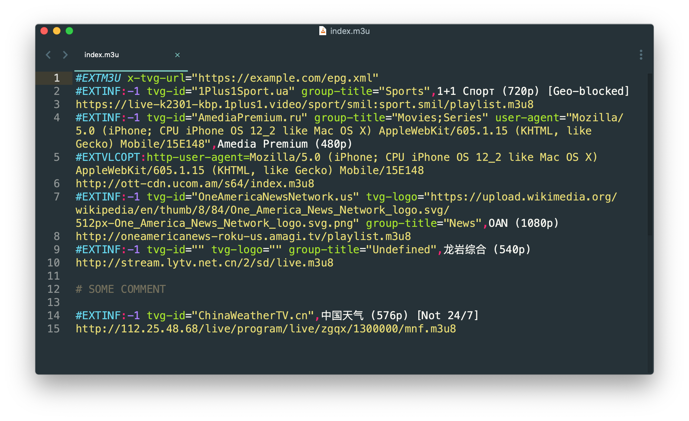

# M3U

Syntax highlighting for [M3U](https://en.wikipedia.org/wiki/M3U) playlists in [Sublime Text 4](http://www.sublimetext.com/).

## Installation

### Package Control

Installation through [package control](https://packagecontrol.io/) is recommended. It will handle updating your packages as they become available. To install, do the following.

- In the Command Palette, enter `Package Control: Install Package`
- Search for `M3U`

### Manual

Clone or copy this repository into the packages directory. You will need to rename the folder to `M3U` if using this method. By default, the Package directory is located at:

- OS X: ~/Library/Application Support/Sublime Text/Packages/
- Windows: %APPDATA%/Roaming/Sublime Text/Packages/
- Linux: ~/.config/sublime-text/Packages/

## License

[MIT](LICENSE)
